# Demo1-1:利用Github Action 部署至Azure App Service

进入Github Repo中 并且点击Actions进行CICD Pipeline流水线设置

在Actions之中新建一个Workflow

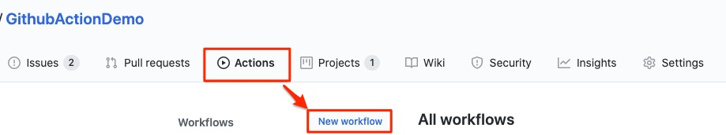

选取 .NET Core Template

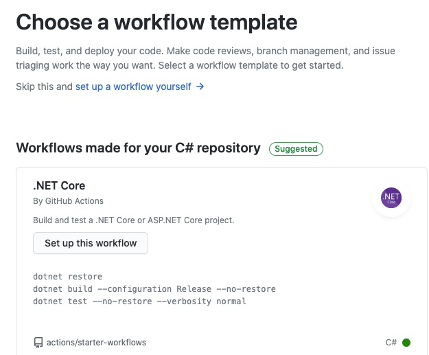

接着获得dotnet-core的workflows yml档案

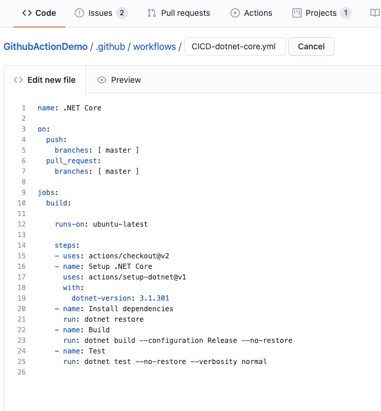

接着此Demo并不将CICD流水线分开进行设置, 而是CI结束后进行CD

在右方的Marketplace中Search `Azure WebApp`

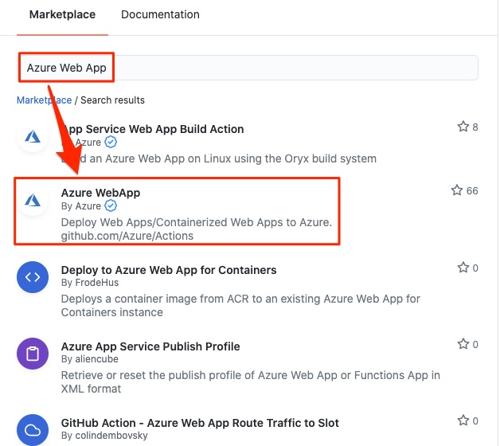

并将以下相关yml字串复制到左方的Jobs Steps之中

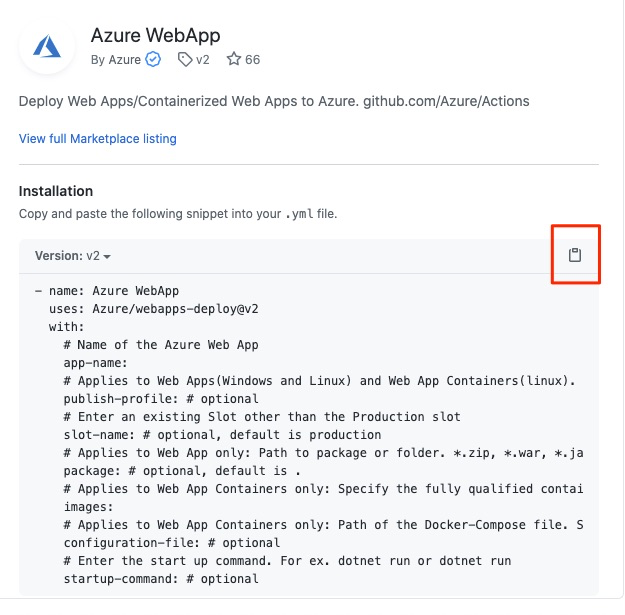

该Marketplace的[参考文档](https://github.com/marketplace/actions/azure-webapp)

```
      # Deploy to Azure Web apps
      - name: 'Run Azure webapp deploy action using publish profile credentials'
        uses: azure/webapps-deploy@v2
        with: 
          app-name: '${{ env.AZURE_WEBAPP_NAME }}' # Replace with your app name
          publish-profile: '${{ secrets.ALANAPPSERVICEPROFILE }}'
          package: '${{ env.AZURE_WEBAPP_PACKAGE_PATH }}/myapp'
```

接着新增环境变量, 在jobs 之上(需修改预先创好的WebApp目标名称)

```
env:
  AZURE_WEBAPP_NAME: 'GAD-WebAppDemo'
  AZURE_WEBAPP_PACKAGE_PATH: '.'
  DOTNET_VERSION: '3.1.100'
```

完整的yml 已设置完毕 参考如下

```
name: Deploy ASP.NET Core app to Azure Web App

on:
  push:
    branches:
      - master
  pull_request:
    branches:
      - '*'
# CONFIGURATION
# For help, go to https://github.com/Azure/Actions
#
# 1.1 Set up the following secrets in your repository:
#   AZURE_WEBAPP_PUBLISH_PROFILE
#
# 2. Change these variables for your configuration:
env:
  AZURE_WEBAPP_NAME: 'GAD-WebAppDemo'    # set this to your application's name
  AZURE_WEBAPP_PACKAGE_PATH: '.'      # set this to the path to your web app project, defaults to the repository root
  DOTNET_VERSION: '3.1.100'           # set this to the dot net version to use

jobs:
  build-and-deploy:
    runs-on: ubuntu-latest
    steps:

      # Checkout the repoff
      - uses: actions/checkout@master
      
      # Setup .NET Core SDK
      - name: Setup .NET Core
        uses: actions/setup-dotnet@v1
        with:
          dotnet-version: ${{ env.DOTNET_VERSION }} 
      
      # Run dotnet build and publish
      - name: dotnet build and publish
        run: |
          dotnet build --configuration Release
          dotnet publish -c Release -o '${{ env.AZURE_WEBAPP_PACKAGE_PATH }}/myapp' 
    
      # Deploy to Azure Web apps
      - name: 'Run Azure webapp deploy action using publish profile credentials'
        uses: azure/webapps-deploy@v2
        with: 
          app-name: '${{ env.AZURE_WEBAPP_NAME }}' # Replace with your app name
          publish-profile: '${{ secrets.ALANAPPSERVICEPROFILE }}'
          package: '${{ env.AZURE_WEBAPP_PACKAGE_PATH }}/myapp'
      

```

接着我们需要获取App Service中的发布配置文件并且将其加入到Github Secrets之中

点击Setting>Secrets 新增Secret

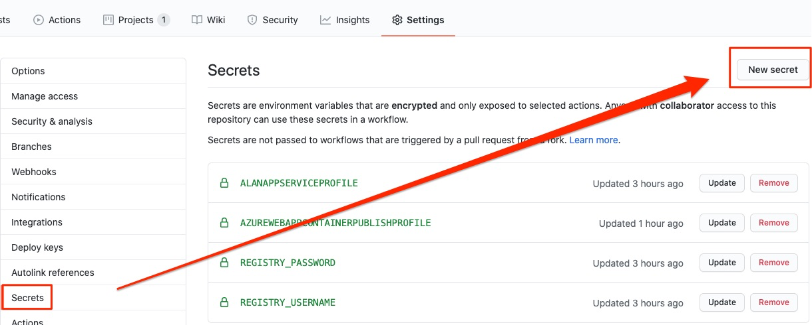

设置secrets名称与上方yml之内的参数名称相同
此处采用ALANAPPSERVICEPROFILE

Value部分利用Azure Portal下载App Service的发布配置文件并且将其全部复制贴上


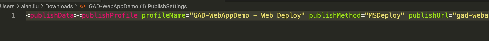

到此处已完成所有相关CICD设置

回到Github Action之中 进行Pipeline workflows Commit

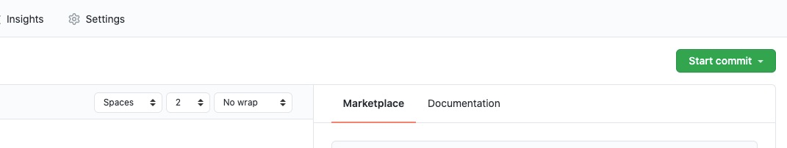

此时CICD流程已经启动 点回Actions页签 选取刚刚设置的Workflows进行查看

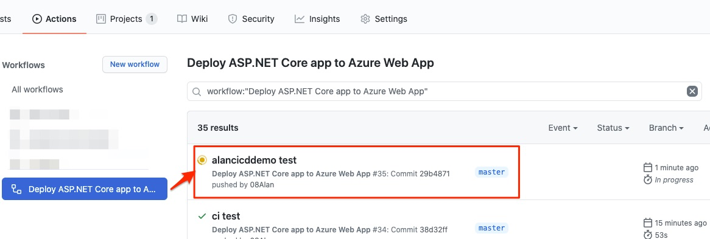

CICD流水线结束后 项目发布完成

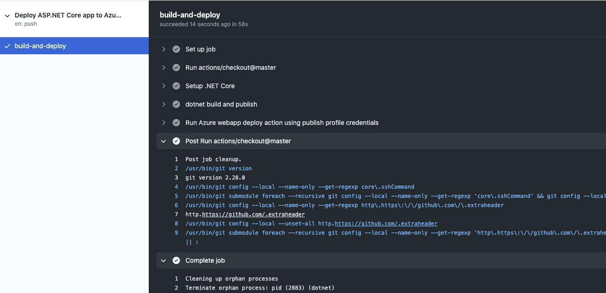

访问App Service 并且加入后方路由地址后 可获得相关天气资讯

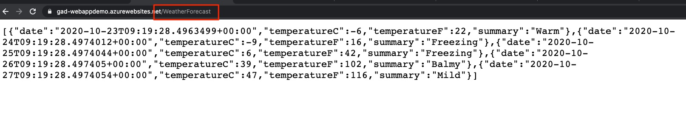