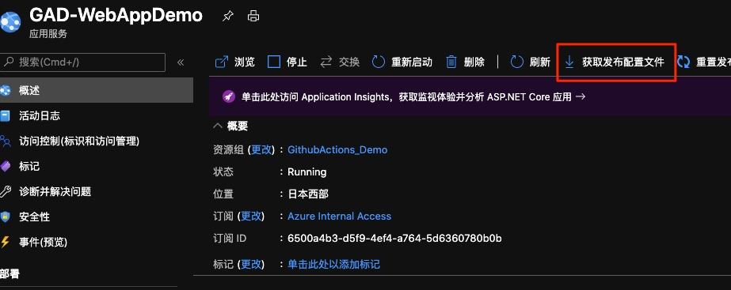

# Demo1-1:利用Github Action 部署至App Service(windows)

進入Github Repo中 並且點擊Actions進行CICD Pipeline流水線設置

在Actions之中新建一個Workflow


選取 .NET Core Template


接著獲得dotnet-core的workflows yml檔案


接著此Demo並不將CICD流水線分開進行設置, 而是CI結束後進行CD

故直接在右方的Marketplace中Search `Azure WebApp`


並將以下相關yml字串複製到左方的Jobs steps之中


該Marketplace的[參考文檔](https://github.com/marketplace/actions/azure-webapp)

```
      # Deploy to Azure Web apps
      - name: 'Run Azure webapp deploy action using publish profile credentials'
        uses: azure/webapps-deploy@v2
        with: 
          app-name: '${{ env.AZURE_WEBAPP_NAME }}' # Replace with your app name
          publish-profile: '${{ secrets.ALANAPPSERVICEPROFILE }}'
          package: '${{ env.AZURE_WEBAPP_PACKAGE_PATH }}/myapp'
```

接著新增環境變量, 在jobs 之上(需修改預先創好的WebApp目標名稱)

```
env:
  AZURE_WEBAPP_NAME: 'GAD-WebAppDemo'
  AZURE_WEBAPP_PACKAGE_PATH: '.'
  DOTNET_VERSION: '3.1.100'
```

完整的yml 已設置完畢 參考如下

```
name: Deploy ASP.NET Core app to Azure Web App

on:
  push:
    branches:
      - master
  pull_request:
    branches:
      - '*'
# CONFIGURATION
# For help, go to https://github.com/Azure/Actions
#
# 1.1 Set up the following secrets in your repository:
#   AZURE_WEBAPP_PUBLISH_PROFILE
#
# 2. Change these variables for your configuration:
env:
  AZURE_WEBAPP_NAME: 'GAD-WebAppDemo'    # set this to your application's name
  AZURE_WEBAPP_PACKAGE_PATH: '.'      # set this to the path to your web app project, defaults to the repository root
  DOTNET_VERSION: '3.1.100'           # set this to the dot net version to use

jobs:
  build-and-deploy:
    runs-on: ubuntu-latest
    steps:

      # Checkout the repoff
      - uses: actions/checkout@master
      
      # Setup .NET Core SDK
      - name: Setup .NET Core
        uses: actions/setup-dotnet@v1
        with:
          dotnet-version: ${{ env.DOTNET_VERSION }} 
      
      # Run dotnet build and publish
      - name: dotnet build and publish
        run: |
          dotnet build --configuration Release
          dotnet publish -c Release -o '${{ env.AZURE_WEBAPP_PACKAGE_PATH }}/myapp' 
    
      # Deploy to Azure Web apps
      - name: 'Run Azure webapp deploy action using publish profile credentials'
        uses: azure/webapps-deploy@v2
        with: 
          app-name: '${{ env.AZURE_WEBAPP_NAME }}' # Replace with your app name
          publish-profile: '${{ secrets.ALANAPPSERVICEPROFILE }}'
          package: '${{ env.AZURE_WEBAPP_PACKAGE_PATH }}/myapp'
      

```

接著我們需要獲取App Service中的發佈配置文件並且將其加入到Github Secrets之中

點擊Setting>Secrets 新增Secret


設置secrets名稱與上方yml之內的參數名稱相同
此處採用ALANAPPSERVICEPROFILE

Value則需要下載App Service的發布配置文件並且將其全部複製貼上




到此處已完成所有相關CICD設置

回到Github Action之中 進行Pipeline workflows Commit


此時CICD流程已經啟動 點回Actions頁籤 選取剛剛設置的Workflows進行查看


CICD流水線結束後 項目發布完成


訪問App Service 並且加入後方路由地址後 可獲得相關天氣資訊

