# Demo1-2:利用Github Action 部署至App Service for Container

利用Visual Studio将此天气API接口利用Publish进行容器映像打包
并且将其推送至Azure Container Registry之中

右键点击项目进行Publish

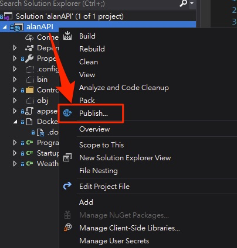

发布目标选择Container Registry选取既有的ACR进行部署

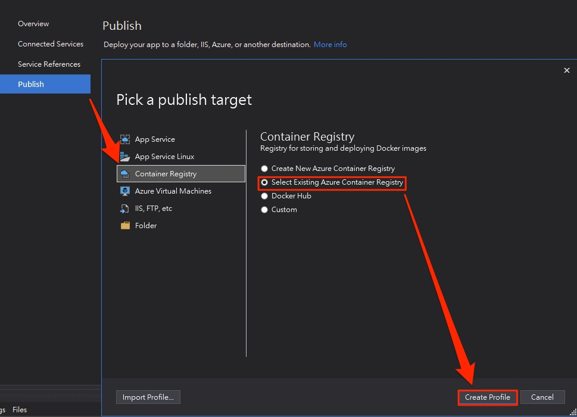

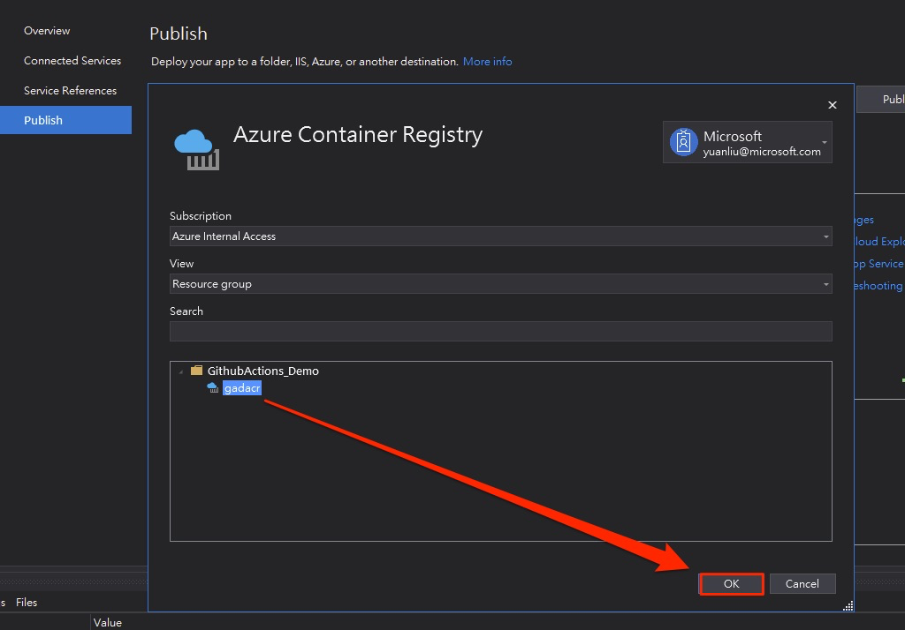

完成设置后开始进行发布

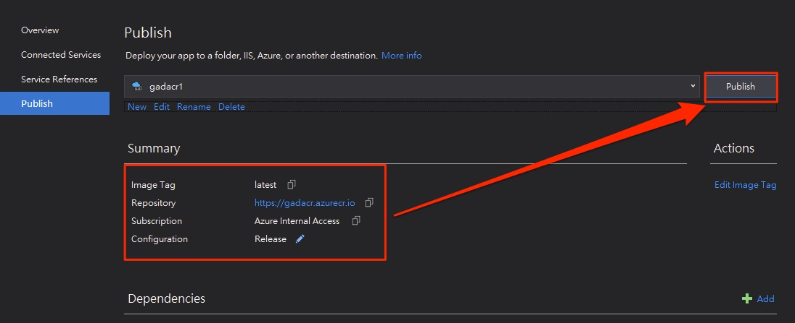

下方建置日志进行 `docker build && docker push`

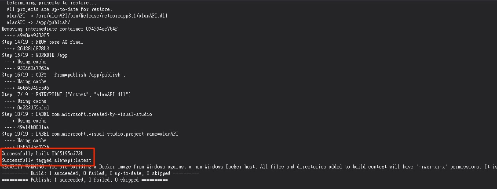

回到Azure Portal 之中 确认Azure Container Registry中的存储库已经Push完毕

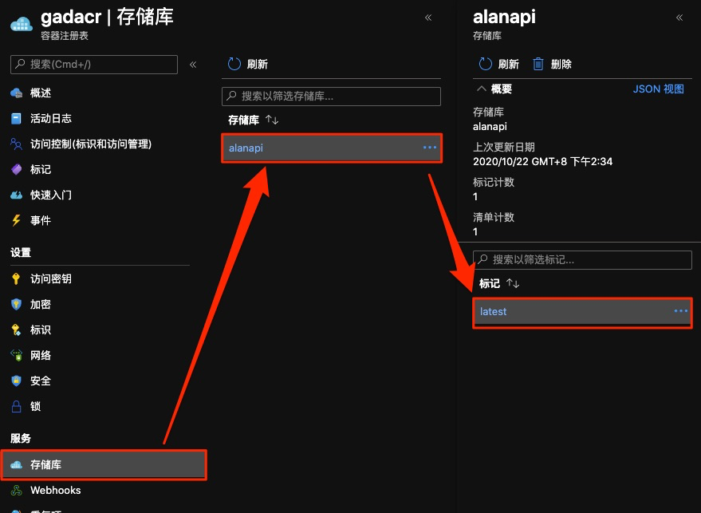

接着开始设置Github Action pipeline流水线

进入到Actions页签, 新增Workflow, 选择Dotnet Core模板

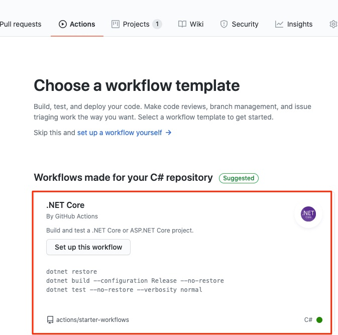

与Demo1-1相同 在最下方加入Azure App Service for Container Deploy steps
不过此时加入需要拉取的容器映像位置

```
      - uses: azure/webapps-deploy@v2
        with:
          app-name: '${{ env.AZURE_WEBAPP_NAME }}'
          publish-profile: ${{ secrets.azureWebAppContainerPublishProfile }}
          images: 'gadacr.azurecr.io/alanapi:latest'
```

! 注意这里的App Service for Contaier的发布配置文件有Bug 需将下载回来的Profile手动编辑将PublishURL修改

`publishUrl="yoursitename.scm.azurewebsites.net:443"`

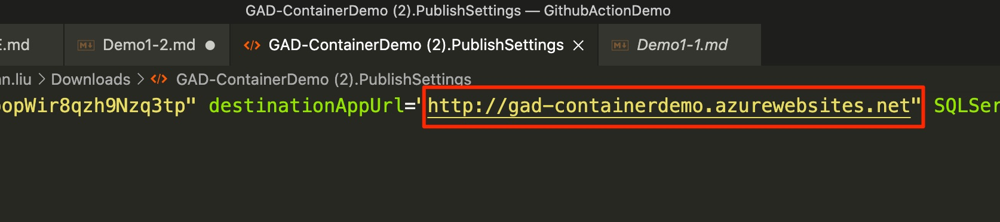

修改完后将此Profile加入Secrets

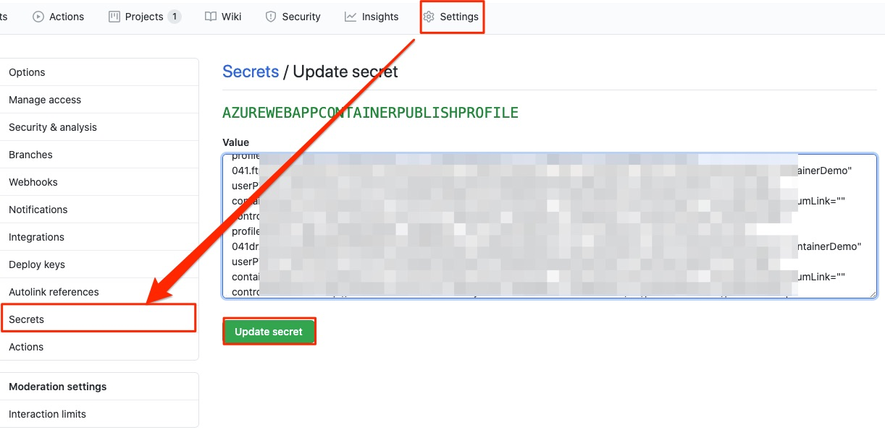

此时已配置完毕Actions流水线, 完整的yml如下：

```
name: AppServiceContainer

on:
  push:
    branches:
      - master
  pull_request:
    branches:
      - '*'
# CONFIGURATION
# For help, go to https://github.com/Azure/Actions
#
# 1.1 Set up the following secrets in your repository:
#   AZURE_WEBAPP_PUBLISH_PROFILE
#
# 2. Change these variables for your configuration:
env:
  AZURE_WEBAPP_NAME: 'GAD-ContainerDemo'    # set this to your application's name
  AZURE_WEBAPP_PACKAGE_PATH: '.'      # set this to the path to your web app project, defaults to the repository root
  DOTNET_VERSION: '3.1.100'           # set this to the dot net version to use

jobs:
  build-and-deploy:
    runs-on: ubuntu-latest
    steps:

      # Checkout the repoff
      - uses: actions/checkout@master
      
      # Setup .NET Core SDK
      - name: Setup .NET Core
        uses: actions/setup-dotnet@v1
        with:
          dotnet-version: ${{ env.DOTNET_VERSION }} 
      
      # Run dotnet build and publish
      - name: dotnet build and publish
        run: |
          dotnet build --configuration Release
          dotnet publish -c Release -o '${{ env.AZURE_WEBAPP_PACKAGE_PATH }}/myapp' 

      - uses: azure/webapps-deploy@v2
        with:
          app-name: '${{ env.AZURE_WEBAPP_NAME }}'
          publish-profile: ${{ secrets.azureWebAppContainerPublishProfile }}
          images: 'gadacr.azurecr.io/alanapi:latest'
      
```

回到Github Action之中 进行Pipeline workflows Commit

此时CICD流程已经启动 点回Actions页签 选取刚刚设置的Workflows进行查看

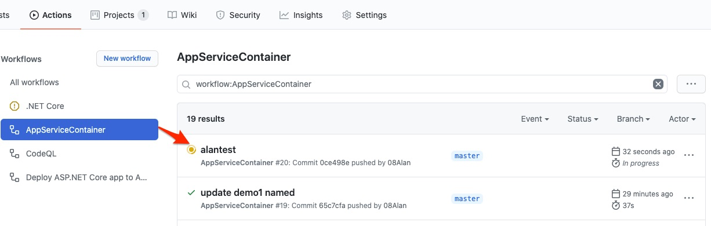

CICD流水线结束后 项目发布完成

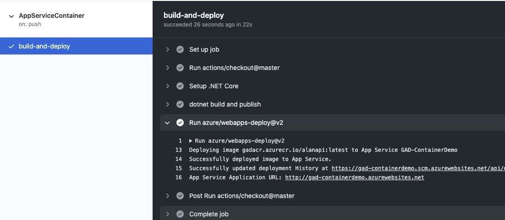

访问App Service 并且加入后方路由地址后 可获得相关天气资讯

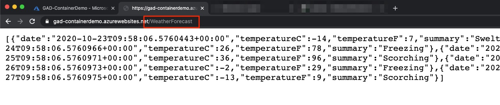