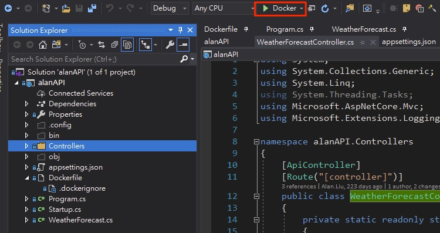
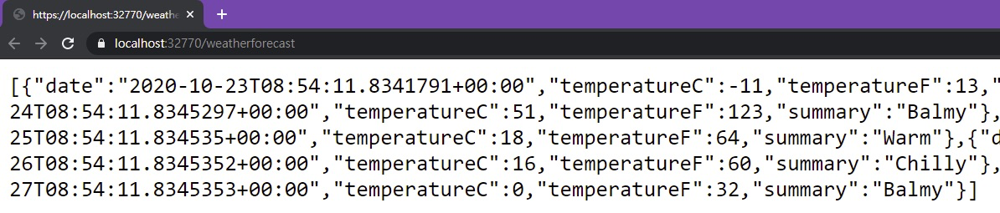

# GithubActionDemo New Features Demo

## 环境配置：

- Github Personal Account
- Visual Studio 2019 or Visual Studio Code
- Azure CLI Client Tool

## Azure资源预配

Azure Resource：
-	2 * App Service
    - Azure App Service Windows
    - Azure App Service for Container
-	1 Container Registry

## 项目说明
alanAPI是一个利用.NET Core撰写的天气API接口
此项目仅有一个API路由
EX: `contoso.azurewebsites.net/WeatherForecast`

Clone至本地后可利用Visual Studio 建置此天气API项目

> 注意: 采用Docker进行建置需安装Docker client相关工具

## Demo 环节

 1. 利用Github Action 完成App Service中的部署

    - [部署一：将API部署至App Service Windows中](https://github.com/08Alan/GithubActionDemo/blob/master/Demo1-1.md)

    - [部署二：将API部署至App Service for Container且利用Visual Studio推送容器]](https://github.com/08Alan/GithubActionDemo/blob/master/Demo1-2.md)

  2. Github Security

    - [TBD-Dependabot：扫描代码安全漏洞](https://github.com/08Alan/GithubActionDemo/projects/1)

    - [TBD-Code Scanning：利用CodeQL进行CICD流程时的代码漏洞扫描](https://github.com/08Alan/GithubActionDemo/projects/1)

  3. [TBD-Github CodeSpaces 代码远程协作功能](https://github.com/08Alan/GithubActionDemo/projects/1)

  4. [TBD-Github Project 达成项目工作流程控管](https://github.com/08Alan/GithubActionDemo/projects/1)