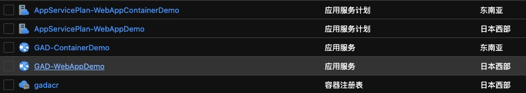

# GithubActionDemo New Features Demo

## 預先環境配置：

Github Personal Account
Visual Studio 2019

## 創建空的Azure資源
Azure Resource：
-	2 * App Service
    - Azure App Service Windows
    - Azure App Service for Container
-	1 Container Registry

